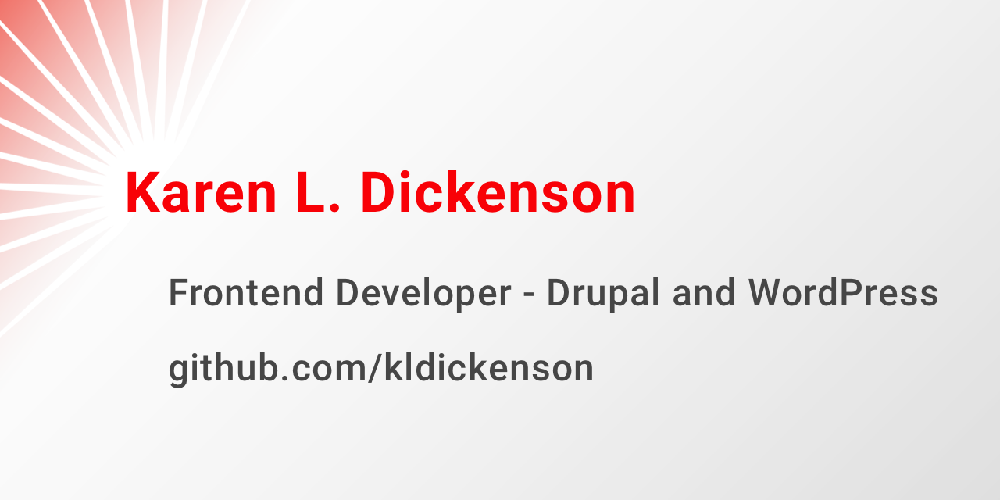

>)

### My Open Source Contributions

-   [Protegé (accessibility audit and fixes)](https://github.com/drewclem/protege/issues/151)
-   [VirtualCoffee.io (CSS layout issue)](https://github.com/Virtual-Coffee/virtualcoffee.io/issues/41)

### Latest Blog Posts

<!-- BLOG-POST-LIST:START -->
- [Job Hunt 2021](https://dev.to/kldickenson/job-hunt-2021-19c9)
- [Bullet Journal - 2021 version](https://dev.to/kldickenson/bullet-journal-2021-version-46oe)
- [Tackling Advent of Code 2020](https://dev.to/kldickenson/tackling-advent-of-code-202-4d8g)
- [Another Step to Vanquishing Imposter Syndrome](https://dev.to/kldickenson/another-step-to-vanquishing-imposter-syndrome-4nk2)
- [Exercism Teams - The support I needed](https://dev.to/kldickenson/exercise-teams-the-support-i-needed-3390)
<!-- BLOG-POST-LIST:END -->

---

-   🌱 I’m currently learning to take Drupal and WordPress headless with React,
    Gatsby, and Vue.js.
-   😄 Pronouns: She/Her
-   📫 [Reach me by email](mailto:kldinteractive@gmail.com)

<!--
**kldickenson/kldickenson** is a ✨ _special_ ✨ repository because its `README.md` (this file) appears on your GitHub profile.

Here are some ideas to get you started:

- 🔭 I’m currently working on ...
- 🌱 I’m currently learning ...
- 👯 I’m looking to collaborate on ...
- 🤔 I’m looking for help with ...
- 💬 Ask me about ...
- 📫 How to reach me: ...
- 😄 Pronouns: ...
- ⚡ Fun fact: ...
-->
